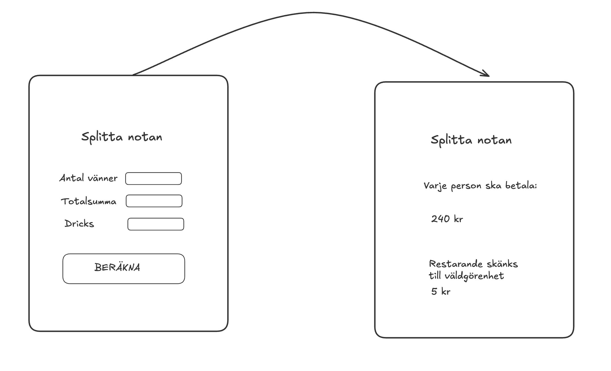

# 🧾 Workshop: Splitta notan

Er uppgift är att göra webbapplikationen Splitta notan enligt skissen. Användaren fyller i **Antal vänner**, **Totalsumma** och **Dricks** i ett formulär, och appen räknar ut vad varje person ska betala.

HTML och CSS är färdiga. Ni skriver all JavaScript själva i `js/app.js`.



Extra: Ta hand om resten och visa hur mycket som skänks till välgörenhet.

---

## 🧮 Så ska appen räkna

1. Lägg på dricksen på totalsumman. Dricksen anges i **procent**.
2. Avrunda uppåt till hela kronor.
3. Dela på antal vänner. Var och en betalar ett **jämnt antal kronor**, så avrunda **nedåt**.
4. Det som blir över skänks till välgörenhet (EXTRA-1).

| Vänner | Totalsumma | Dricks | Med dricks | Var och en | Till välgörenhet |
|---|---|---|---|---|---|
| 4 | 880 kr | 10 % | 968 kr | **242 kr** | 0 kr |
| 3 | 650 kr | 10 % | 715 kr | **238 kr** | 1 kr |
| 4 | 873 kr | 10 % | 961 kr | **240 kr** | 1 kr |
| 6 | 1 234 kr | 0 % | 1 234 kr | **205 kr** | 4 kr |

Använd tabellen när ni testar.

---

## 🧠 Innan ni kodar

**Diskutera i teamet:**

* Vad är DOM:en?
* Hur hämtar man ett element i DOM:en med `querySelector` och ett id?
* Vad gör `addEventListener`?
* Hur skickar man ett formulär med `addEventListener` utan att sidan laddas om?
* Varför är värdet i ett `input` alltid en sträng, även när `type="number"`? Hur gör man om text till ett tal?
* Hur kan man dölja och visa ett element med JavaScript beroende på ett villkor?

**Rita ett flödesdiagram** på papper eller i Excalidraw: vad händer från att användaren klickar *Beräkna* till att resultatet syns? Vad händer om ett fält är tomt? Rita först, koda sen.

---

## 📁 Startfilen

HTML och CSS är färdiga. `js/app.js` innehåller bara tre rubriker — resten skriver ni själva:

```js
// ---------- 1. Element i DOM:en ----------
// ---------- 2. Funktioner ----------
// ---------- 3. Händelser ----------
```

Håll er till den ordningen. Då vet alla i gruppen var saker ska ligga, och det blir färre merge-konflikter.

### Det här finns i HTML:en

| Selektor | Vad det är |
|---|---|
| `#bill-form` | Formuläret |
| `#friends`, `#total`, `#tip` | De tre fälten |
| `#error` | Tom rad för felmeddelanden |
| `#result` | Resultatvyn, dold med `hidden` från början |
| `#per-person` | Där beloppet per person ska stå |
| `#charity`, `#rest` | Välgörenhetsrutan och beloppet (EXTRA-1) |
| `#btn-reset` | Knappen "Ny beräkning", dold (EXTRA-2) |

### Funktionerna ni ska skriva

Bestäm namnen tillsammans innan ni delar upp er, så att delarna passar ihop. Förslag:

| Funktion | Tar emot | Returnerar / gör |
|---|---|---|
| `getFormValues()` | – | `{ friends, total, tip }` som **tal** |
| `calculateSplit(friends, total, tip)` | tre tal | `{ perPerson, rest }`. Rör inte DOM:en. |
| `showResult(perPerson)` | ett tal | Döljer formuläret och visar resultatet |
| `validate(values)` | `{ friends, total, tip }` | `true` eller `false`, och skriver felmeddelandet |
| `handleSubmit(event)` | submit-eventet | Kopplar ihop allt ovan |

Varje funktion gör **en sak** och kan testas för sig i konsolen, innan resten är klart. Skriv t.ex. `calculateSplit(4, 880, 10)` i DevTools → Console och se vad som kommer tillbaka.

**Två regler som gör det enklare:**

1. **Räkna i en funktion, visa i en annan.** `calculateSplit()` rör inte DOM:en, den tar emot tal och returnerar tal. Det är `showResult()` som skriver ut.
2. **Testa efter varje rad.** Lägg in en `console.log()` och kolla i DevTools innan ni går vidare.

---

## 🎫 Tickets

**NOTA-1** gör ni tillsammans, på en dator, och mergar först. **NOTA-2 till NOTA-4** kan sedan göras parallellt. **NOTA-5** kopplar ihop allt. **EXTRA** gör ni om ni hinner.

### NOTA-1 · Formuläret skickas utan att sidan laddas om — tillsammans

Hämta formuläret och fälten under *Element i DOM:en*. Skriv `getFormValues()` och `handleSubmit()`, och koppla `handleSubmit` till formulärets `submit`-event under *Händelser*.

**Klart när:** sidan laddas inte om när man klickar *Beräkna* eller trycker Enter, och konsolen visar ett objekt med `friends`, `total` och `tip` där alla tre är **tal**, inte strängar.

*Tips:* `addEventListener('submit', ...)`, `event.preventDefault()`, `Number()`

### NOTA-2 · Räkna ut notan

Skriv `calculateSplit(friends, total, tip)`. Funktionen rör inte DOM:en.

**Klart när:** alla fyra raderna i tabellen ovan ger rätt `perPerson` och `rest` när ni kör funktionen i konsolen.

*Tips:* `Math.ceil()`, `Math.floor()`, och `%` eller subtraktion för resten. Läs "Decimaltal i JavaScript" under *Bra att veta*.

### NOTA-3 · Visa resultatet

Skriv `showResult(perPerson)`.

**Klart när:** `showResult(242)` i konsolen döljer formuläret, visar resultatvyn och det står **242 kr**.

*Tips:* `element.hidden = true`, `textContent`

### NOTA-4 · Felmeddelande

Skriv `validate(values)`.

**Klart när:** tomma fält, 0 vänner, 2,5 vänner, en totalsumma på 0 eller negativ dricks ger ett felmeddelande i `#error` som säger **vad** som är fel, och funktionen returnerar `false`. Rätt värden tömmer felmeddelandet och returnerar `true`.

*Tips:* Ett tomt fält blir `0` med `Number("")`. `Number.isInteger()` kollar heltal.

### NOTA-5 · Koppla ihop

När NOTA-2 till NOTA-4 är mergade: låt `handleSubmit()` validera, räkna och visa resultatet.

**Klart när:** alla fyra raderna i tabellen ger rätt belopp när man fyller i formuläret, och felaktiga värden ger ett felmeddelande i stället för ett resultat.

### EXTRA-1 · Välgörenhet

**Klart när:** resultatvyn visar hur mycket som skänks till välgörenhet, enligt tabellen. Rutan döljs om resten är 0.

*Tips:* `showResult()` behöver ta emot `rest` också. `#charity` och `#rest` finns redan i HTML:en.

### EXTRA-2 · Ny beräkning

Knappen `#btn-reset` finns redan i HTML:en, men är dold.

**Klart när:** knappen syns i resultatvyn, och ett klick tar användaren tillbaka till formuläret med fälten tomma.

*Tips:* `reset()` på formuläret tömmer alla fält.

### EXTRA-3 · Snabbval för dricks

**Klart när:** det finns tre knappar under dricksfältet — **5 %**, **10 %** och **15 %** — som fyller i dricksfältet när man klickar på dem. De ska gå att använda med tangentbordet.

*Tips:* Använd `<button type="button">`. Utan `type="button"` skickar knappen formuläret.

---

## 🔗 Bra att veta

### Decimaltal i JavaScript

Datorn räknar med decimaltal i binär form, och vissa tal går inte att lagra exakt:

```js
880 * 1.1           // 968.0000000000001
880 * 110 / 100     // 968
```

`Math.ceil(968.0000000000001)` blir **969**. Räkna därför med heltal först och dela sist: `total * (100 + tip) / 100`.

### Länkar

* [addEventListener (MDN)](https://developer.mozilla.org/en-US/docs/Web/API/EventTarget/addEventListener)
* [submit-eventet (MDN)](https://developer.mozilla.org/en-US/docs/Web/API/HTMLFormElement/submit_event)
* [preventDefault (MDN)](https://developer.mozilla.org/en-US/docs/Web/API/Event/preventDefault)
* [Number() (MDN)](https://developer.mozilla.org/en-US/docs/Web/JavaScript/Reference/Global_Objects/Number/Number)
* [hidden-attributet (MDN)](https://developer.mozilla.org/en-US/docs/Web/HTML/Global_attributes/hidden)

---

## 🚀 Kom igång

### 1. En i gruppen skapar repot

1. Klicka **Use this template → Create a new repository** högst upp i det här repot.
2. Döp det till `workshop-splitta-notan-grupp-N` (byt ut N mot ert gruppnummer) och gör det **Public**.
3. **Settings → Collaborators → Add people.** Lägg till alla i gruppen.

### 2. Alla klonar gruppens repo

```bash
git clone <adressen till ert grupprepo>
cd workshop-splitta-notan-grupp-N
```

Öppna `index.html` med Live Server.

### 3. Fördela tickets

Varje funktion är en egen ticket, så efter NOTA-1 kan ni jobba parallellt. Ett förslag för fyra personer:

| Person | Ticket | Funktion |
|---|---|---|
| Alla | NOTA-1 | Tillsammans på en dator. Mergas först. |
| A | NOTA-2 | `calculateSplit()` |
| B | NOTA-3 | `showResult()` |
| C | NOTA-4 | `validate()` |
| D | NOTA-5 | Kopplar ihop i `handleSubmit()`, och granskar under tiden |

Är ni färre, ta två var. Sitt gärna två och två på samma dator.

---

## 🔀 Så jobbar ni i Git tillsammans

**Ingen pushar direkt till `main`.** Allt går via en branch och en pull request som någon annan i gruppen granskar.

### För varje ticket

```bash
# 1. Utgå alltid från senaste main
git switch main
git pull

# 2. Skapa en branch för ticketen
git switch -c nota-2-rakna-ut

# 3. Koda, testa, committa. Skriv ticket-id först i meddelandet
git add .
git commit -m "NOTA-2: räknar ut belopp per person och rest"

# 4. Pusha branchen
git push -u origin nota-2-rakna-ut
```

### Öppna en pull request

1. Gå till ert repo på GitHub. Klicka **Compare & pull request** i den gula rutan.
2. Kontrollera att det står **base: `main`** och **compare: er branch**.
3. Fyll i PR-mallen och klicka **Create pull request**.
4. Lägg till en gruppkamrat under **Reviewers** och säg till i gruppen.

### Granska och merga

Den som granskar **hämtar hem branchen och testar** innan hen godkänner:

```bash
git fetch origin
git switch nota-2-rakna-ut
```

Hur ni granskar står i [REVIEW.md](REVIEW.md). När granskaren klickat **Approve** trycker hen på **Merge pull request**.

### När någon annans PR har mergats

```bash
git switch main
git pull
```

Jobbar du fortfarande på en egen branch, hämta in det nya:

```bash
git switch min-branch
git merge main
```

### Merge-konflikt?

Två har ändrat samma rader. Öppna filen i VS Code, välj vilken version som ska vara kvar (eller båda), ta bort markeringarna `<<<<<<<`, `=======` och `>>>>>>>`, och committa. Gör det tillsammans med den andra personen — det är ni två som vet vad koden ska göra.

---

## 📤 När ni är klara

1. Alla tickets är mergade till `main`, och appen fungerar när ni kör `main`:

   - **Räkna igenom tabellen.** Ger alla fyra raderna rätt belopp?
   - **Testa kanterna.** Skicka formuläret tomt. Skriv 0 vänner, 2,5 vänner och negativ dricks. Tryck Enter i ett fält i stället för att klicka på knappen.
   - **Tangentbordet.** Lägg undan musen. Går det att fylla i och skicka formuläret med bara Tab och Enter?
   - **Konsolen.** DevTools → Console. Inga röda fel.

2. Klistra in länken till ert grupprepo i **#fjs26**.

Lycka till! 🤩

*// Sandra*
